Link to arXiv paper: https://arxiv.org/pdf/2011.08461.pdf

```python
import arrayflow as af
import numpy as np
import matplotlib.pyplot as plt
```

# Demo 1: The Catenary

Section 6.1 in the paper.

Link to video: https://youtu.be/wvNH6e5fD1w


```python
def gradstep(x, stepsize):
    x.array -= stepsize * x.partial_derivative
```


```python
np.random.seed(1)
n = 50
deltax2 = 1 / (n - 1)**2
x = np.linspace(0, 1, n)
initial = .1 * np.random.rand(n) - .1
initial[0] = 0.0
initial[-1] = 0.0
y = af.Parameter(initial)
length_kernel = af.Constant([-1, 1])
centroid_kernel = af.Constant([.5, .5])
rope_length = 1.1
```

The initial point can be quite random:


```python
plt.figure(figsize=(10, 5))
plt.ylim(-.5, 0)
plt.xlim(0, n-1)
plt.plot(y.array, linewidth=3)
```

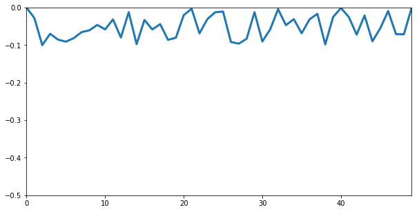


```python
snapshots = np.logspace(0, 4, 100, dtype=int)
hist = []

for k in range(10001):
    deltay = af.ccor(y, length_kernel)
    s = af.sqrt(deltax2 + deltay**2)
    L = af.sum(s)
    ybar = af.ccor(y, centroid_kernel)
    cg = af.sum(s * ybar)
    l = (L - rope_length)**2 + cg

    l.compute_gradient()
    y.partial_derivative[0] = 0
    y.partial_derivative[-1] = 0
    gradstep(y, 0.005)
    
    if k in snapshots:
        hist.append(y.array.copy())
```


```python
%matplotlib notebook
from matplotlib.animation import FuncAnimation

fig, ax = plt.subplots()
fig.set_size_inches(10, 5)
ln, = plt.plot([], 'salmon', linewidth=3)

def init():
    ax.set_xlim(0, 50)
    ax.set_ylim(-.6, 0)
    return ln,

def update(frame):
    ax.cla()
    ax.set_xlim(0, 50)
    ax.set_ylim(-.6, 0)
    return ax.plot(hist[frame], 'salmon', linewidth=3)

ani = FuncAnimation(fig, update, frames=len(hist),
                    init_func=init, interval=100, blit=True)
```


```python
%matplotlib inline
plt.figure(figsize=(10, 5))
plt.ylim(-.55, 0)
plt.xlim(0, n-1)
plt.plot(y.array, linewidth=3)
```


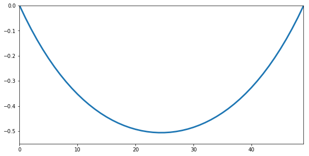


# Demo 2: Classifying Normal Distributions

This is a binary classifier that will distinguish histograms of normally distribuited points (class 1) vs. others (class 0). See section 6.2 in the paper for math details.


```python
t = np.linspace(0, 1, 500)

def gethist(x, bins=16):
    h = np.histogram(x, bins=bins)[0]
    return h / np.sum(h)

def normal():
    x = np.random.randn(len(t))
    return gethist(x)

def other():
    roll = np.random.randint(7)
    if roll > 2:
        p = np.random.randint(1, 5, 3)
        r = p[0] * t**3 - p[1] * t**2 + p[2] * t
    elif roll > 1:
        r = np.random.rand(len(t))
    elif roll == 1:
        r = np.exp((1 + 2 * np.random.rand()) * t)
    else:
        r = np.sin(t * (.1 + 1 *np.random.rand()))
    return gethist(r)

def plotd(x):
    plt.bar(range(len(x)), x, edgecolor='k')
    plt.show()
```


```python
np.random.seed(1)
initf = lambda x: np.random.randn(*x)
kernels = [af.Parameter(initf((5,))) for _ in range(3)]
W1 = af.Parameter(initf((7, 18)))
w1 = af.Parameter(initf((W1.shape[0], 1)))
w2 = af.Parameter(initf((w1.shape[0], 1)))
opt = af.Optimizer()

def lossfunc(yt, y):
    return af.log(af.exp(y) + 1) - yt * y

def model(x):
    x_conved = [af.ccor(x, k) for k in kernels]
    x_conved_pooled = [af.maxpool(s, 2) for s in x_conved]
    v = af.concat(*x_conved_pooled)
    v_expanded = af.expand(v)
    y_0 = W1 @ v_expanded + w1
    y = af.sum(y_0 * w2)
    return y

lt = []
```

Train it for 1-2 minutes


```python
opt = af.Optimizer(.03, True)
for step in range(1000):
    losses = []
    batch_size = 100
    rawy = []
    for n in range(batch_size):
        if n % 2:
            yt = 1
            x = normal()
        else:
            yt = 0
            x = other()
        y = model(x)
        losses.append(lossfunc(yt, y))
    batch_loss = af.add(*losses) / batch_size
    lt.append(float(batch_loss.array))
    opt.update(batch_loss)
```


```python
plt.plot(lt)
plt.title("Loss during training")
plt.show()
```


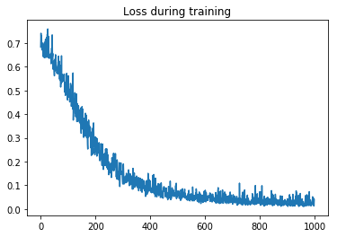


Testing random examples. y > 0 means class 1 (normally distributed)


```python
x = normal()
ypred = model(x).array
print("y prediction:", ypred)
plotd(x)

x = other()
ypred = model(x).array
print("y prediction:", ypred)
plotd(x)
```

    y prediction: 7.3586407
    


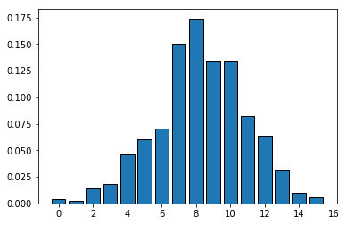


    y prediction: -6.340729
    


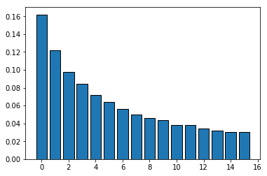


Measuring the accuracy:


```python
test = np.empty((1000,2))
for n in range(len(test)):
    if n % 2:
        test[n, 0] = 1
        x = normal()
    else:
        test[n, 0] = 0
        x = other()
    test[n, 1] = model(x).array > 0.

print("Accuracy", np.sum(test[:, 0] == test[:, 1]) / len(test))
```

    Accuracy 0.991
    

## Demo 2b: Interpretability / Synthetic Generation

Make the input a Parameter object so we can find the gradient of y with respect to x.


```python
np.random.seed(14)
xp0 = other()
xp = af.Parameter(xp0)
y = model(xp)
print(y)
plotd(xp.array)
```

    Node
    -4.1466
    


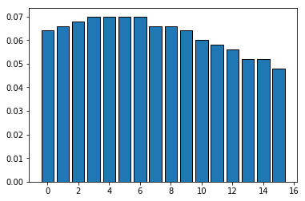


```python
y.compute_gradient()
plt.bar(range(xp.shape[0]), xp.partial_derivative, color='gray')
```


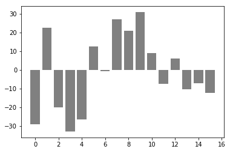


Now change x to transform it from class 0 (other) into class 1 (normal).


```python
def maximize(x, stepsize):
    x.array += stepsize * x.partial_derivative
```


```python
# Run this cell several times. y will increase.
for _ in range(10):
    y = model(xp)
    y.compute_gradient()
    maximize(xp, .0001)
print(y)
plotd(xp.array)
```

    Node
    4.6647
    


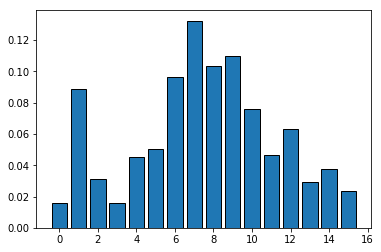


This doesn't look Gaussian, but the model classifies it so.

# Demo 3: Solving Differential Equations & Boundary Value Problems

See section 6.3 in the paper


```python
d_forward = af.Constant([-25/12, 4, -3, 4/3, -1/4]) #4th order
d2_forward = af.Constant([35/12, -26/3, 19/2, -14/3, 11/12]) #3rd order
d_center = af.Constant([1/12, -2/3, 0, 2/3, -1/12]) #4th order
d2_center = af.Constant([-1/12, 4/3, -5/2, 4/3, -1/12]) #4th order
d_back = af.Constant(-d_forward.array) # negative of forward. Even derivatives have same coeffs same as forward.
```


```python
n = 20
dt = 6.1 / (n - 1)
t = np.linspace(0, 6.1, n)
y = af.Parameter(np.sin(t/1.4) + 1)
```


```python
a = np.sqrt(15) * t / 4
y_analytic = (1/3) * np.exp(-t / 4) * (np.sqrt(15) * np.sin(a) + 3 * np.cos(a))
```


```python
def ODE(y):
    # boundary values:
    y.array[0] = 1
    y.array[-1] = .1
    
    front = af.slice(y, 0, 6)
    back = af.slice(y, -6)

    f1 = af.ccor(front, d_forward)
    c1 = af.ccor(y, d_center)
    b1 = af.ccor(back, d_back)

    f2 = af.ccor(front, d2_forward)
    c2 = af.ccor(y, d2_center)
    b2 = af.ccor(back, d2_forward)

    dy = af.concat(f1, c1, b1) / dt
    d2y = af.concat(f2, c2, b2) / dt**2

    return 2 * d2y + dy + 2 * y
```


```python
opt = af.Optimizer(initial_stepsize=1E-4)
```


```python
for step in range(100000):
    ode = ODE(y)
    l = af.sum(ode**2)
    opt.update(l)

print(l.array)
print(opt.stepsize)
```

    Step size capped at: 9.900000000000001e-05
    0.033860445
    7.471720943315964e-05
    


```python
plt.plot(t, y_analytic, 'r--', linewidth=3)
plt.plot(t, y.array)
plt.show()
```


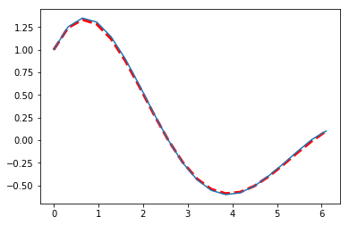


# Demo 4: Automatic Differentiation

We'll have ArrayFlow compute the derivative of the function:

y = |sin(x)| e^(-x/3)

0 <= x <= 12


```python
xa = np.linspace(0, 12, 100, dtype=np.float32)
x = af.Parameter(xa)
y = af.exp(-x / 3) * af.abs(af.sin(x))
```


```python
plt.plot(x.array, y.array, linewidth=3)
plt.grid()
```


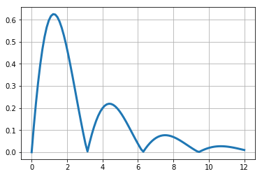


```python
l = af.sum(y)
l.compute_gradient()
plt.plot(xa, x.partial_derivative, 'g', linewidth=3)
plt.grid()
```


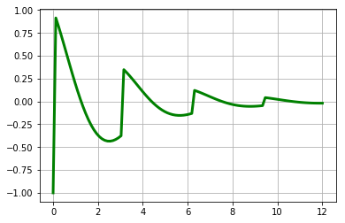


# Demo 5: Finding polynomial coefficients

We'll use gradient optimization to fit this polynomial curve:

y = 0.5 + 1.8t + 2.3t^2 - 0.6t^3


```python
t = np.linspace(0, 5, 20)
yt = af.Constant(np.expand_dims(0.5 + 1.8*t + 2.3*t**2 - .6*t**3, 1))
plt.plot(t, yt.array, linewidth=2)
```


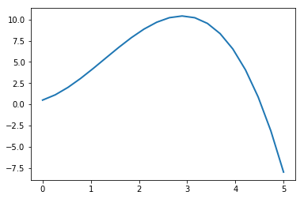


The optimizer will move the 4 parameters to minimize the reconstruction error.


```python
w = af.Parameter([[0], [0], [0], [0]])
T = af.Constant(np.asarray([np.ones(t.shape), t, t**2, t**3]).T)
y = T @ w

opt = af.Optimizer(initial_stepsize=1e-5)
losscurve = []
stepcurve = []
```


```python
# Run this cell multiple times to get closer
for k in range(5000):
    y = T @ w
    l = af.sqrt(af.mean((y - yt)**2))
    opt.update(l)
    
    if k % 10 == 0:
        losscurve.append(float(l.array))
        stepcurve.append(opt.stepsize)

print("Coefficients", [c[0] for c in w.array])
print("Loss:", l.array)
plt.plot(losscurve, 'g')
plt.yscale('log')
plt.show()
plt.plot(stepcurve, 'm')
plt.yscale('log')
```

    Coefficients [0.512116, 1.775064, 2.3112102, -0.60137135]
    Loss: 0.0042264466
    


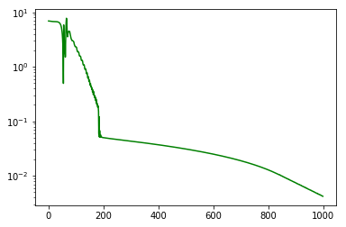


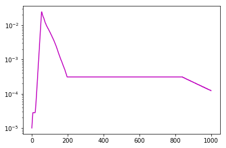


After a while it gets very close.


```python
plt.plot(t, yt.array, 'r--', linewidth=5)
plt.plot(t, y.array, linewidth=2)
```


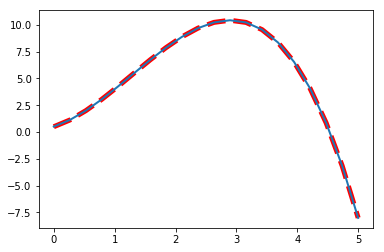


# Demo 6: Stuck in a Local Optimum

This example demonstrates a non-convex optimization problem. We define the following function with parameters a, b, c:

y(t) = e^(at) sin(bt+c)

a = -0.5, b = 4, c = 3


```python
t = np.linspace(0, 5, 100)
yt = af.Constant(np.exp(-.5*t)*np.sin(4*t + 3))
plt.plot(t, yt.array)
```


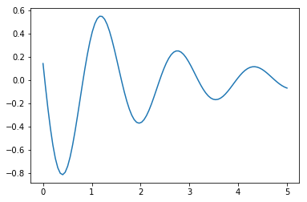


```python
def demo3(initial, steps):
    a, b, c = (af.Parameter(z) for z in initial)
    opt = af.Optimizer(initial_stepsize=0.0001)
    losscurve = []
    stepcurve = []
    
    for k in range(steps):
        y = af.exp(a*t) * af.sin(b*t + c)
        l = af.sqrt(af.mean((y - yt)**2))
        opt.update(l)
        if k % 10 == 0:
            losscurve.append(float(l.array))
            stepcurve.append(opt.stepsize)
    print(a, b, c)

    plt.plot(losscurve, 'g')
    plt.yscale('log')
    plt.title("Loss")
    plt.show()
    plt.plot(stepcurve, 'm')
    plt.yscale('log')
    plt.title("Step Size")
    plt.show()
    y = af.exp(a*t) * af.sin(b*t + c)
    plt.plot(t, yt.array, 'r--', linewidth=5)
    plt.plot(t, y.array, linewidth=2)
```

Choosing any of these as the initial point will get the loss function stuck in a non-global minimum:


```python
initial = 0, 0, 0
# initial = 1, 1, 1
# initial = 1, 1, -1
# initial = -1, 1, 1
demo3(initial, steps=1000)
```

    Step size capped at: 0.8266344832746038
    Parameter
    -1.0285 Parameter
    0.534 Parameter
    -0.6586
    


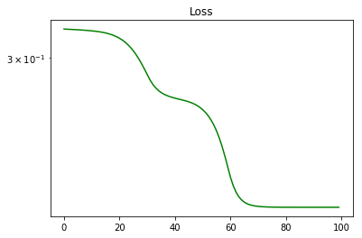


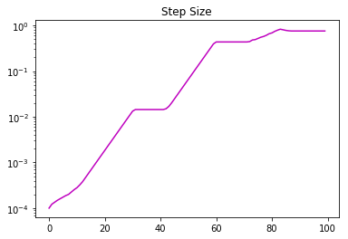


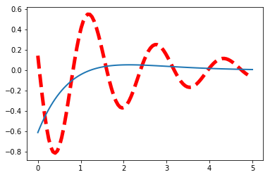


These will take you to global minimum:


```python
# initial = 1, -1, 1
# initial = -1, -1, -1
initial = -.1, 1.2, 1.2 # this is the best one
demo3(initial, 10000)
```

    Step size capped at: 0.6781281929724984
    Parameter
    -0.5 Parameter
    4. Parameter
    3.
    


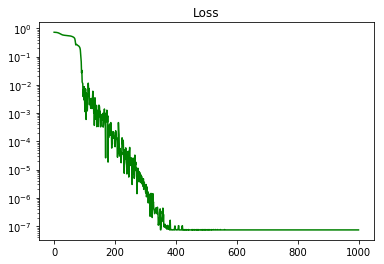


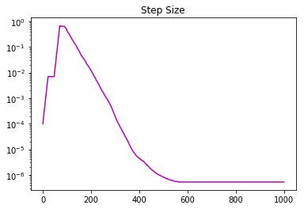


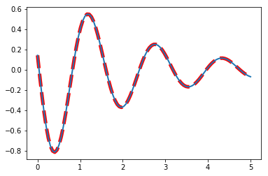


Note that the other initial conditions fit very well, however the parameters a, b, c are different. The "solutions" to this problem are not unique. This is extremely common in deep learning: models with substantially different parameters will have a similar loss.
